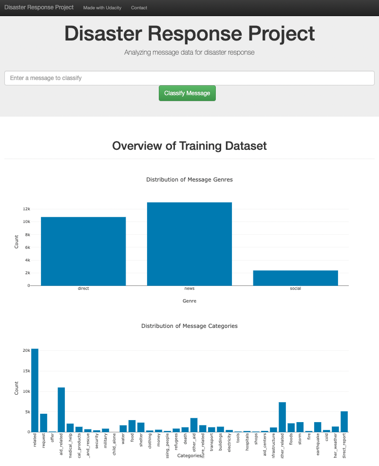
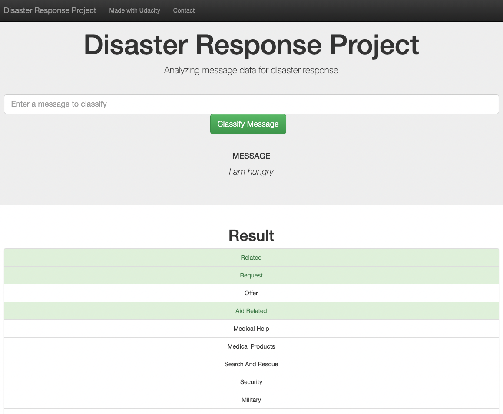

# DATA ENGINEERING - DISASTER RESPONSE PIPELINE

## Introduction

This Project is part of my Data Scientist Nanodegree Program by Udacity. The project aim is to build a Natural Language Processing (NLP) model to categorize messages from a pre-labelled dataset of tweets and messages from real-life disaster events, on a real-time basis, through a simple web app.

This project is divided in the following key sections:

1. Data processing
    - Build an ETL pipeline to extract data from source.
    - Clean the data.
    - Save them in a SQLite DB.
2. Machine Learning model development
    - Build a machine learning pipeline to train a model which can classify text message in various categories.
    - Model evaluation and improvement.
3. Web app
    - Develop a simple web app for this project based on Flask.
    - Run the web app which can show model results in real time.

## Project structure

- `app` : containing source code of the Flask app.
- `assets` : screenshots of the app's demo.
- `data` : data and data-wrangling pipeline.
- `models` : model pipelines, trained one.
- `README.md` : what you are reading now.
- `requirements.txt` : Python package configuration file.

## Installation

1. From repo folder, run `pip install -r requirements.txt` to install all dependencies.
2. ETL pipeline:
    - From repo folder run `python data/process_data.py data/disaster_messages.csv data/disaster_categories.csv data/disresdb.db`.
3. Model training, evaluation and acquisition:
    - From repo folder run `python models/train_classifier.py data/disresdb.db models/best_model.pkl`.
4. Run the app: `python app/run.py`.
5. Go to http://0.0.0.0:3001/.
6. Enjoy.

## Libraries used

The following Python libraries are used in this analysis:

- Core libraries
    - pandas==1.3.3
    - numpy==1.21.2
    - scipy==1.7.3
    - matplotlib==3.4.3
- NLTK
    - nltk==3.6.3
- scikit-learn
    - scikit-learn==0.24.2
- SQLAlchemy
    - SQLAlchemy==1.4.25

## Demo

## Acknowledgements

- Data source: [Appen's Disaster Response Data](https://appen.com/blog/combined-disaster-response-data/)`